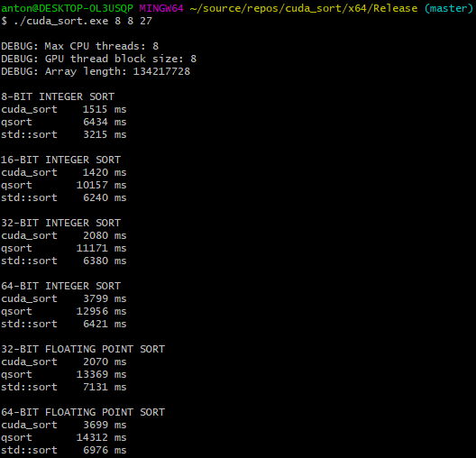

# cuda_sort

## Description

This project contains the source code of `cuda_sort` and a benchmark program that sorts arrays of integers and floating point numbers of various sizes with `cuda_sort`, `qsort` and `std::sort` and prints the results.

The project is purely educational by nature; the code is not meant to be universally applicable.

## Performance

Below is a screenshot of the results of the benchmark.

Interestingly, the relative performance of `cuda_sort` with regard to `std::sort` seems to vary greatly depending on the element size. The ratio is poorest with 64-bit elements, likely because the benchmark was run on a 64-bit Intel CPU.

## Usage

### Cuda_sort

The interface of `cuda_sort` is simple enough:

`template<typename T> T* cuda_sort(T* h_src, size_t array_length, size_t cpu_threads = 8, size_t gpu_thread_block_size = 8)`

| Symbol                  | Description                                                                               |
|:------------------------|:------------------------------------------------------------------------------------------|
| `T`                     | The element type contained by the array. Has to be a variation of `int` or `float`        |
| `h_src`                 | The array to be sorted                                                                    |
| `array_length`          | The number of elements in the array. Must be a power of 2                                 |
| `cpu_threads`           | The maximum number of CPU threads running concurrently. Must be a power of 2 (default: 8) |
| `gpu_thread_block_size` | The number of threads per GPU thread block. Must be a power of 2 (default: 8)             |
| `return value`          | `h_src`                                                                                   |

The user is responsible for checking that the conditions set above are met.

### Benchmark

The benchmark program has a very simple command line interface:

`cuda_sort.exe <number of CPU threads> <GPU thread block size> <array size as power of two>`

The constraints set for the parameters of `cuda_sort` apply. Passing `d` as a command line argument will make the benchmark use the default value.

## Compilation

On Windows:
1. Install Microsoft Visual Studio + Microsoft Visual C++ Compiler
2. Install CUDA Toolkit (with Visual Studio extension)
3. Open `cuda_sort.sln` in Visual Studio and compile the solution

## Compatibility

`Cuda_sort` has only been tested with an Nvidia GTX 1070 graphics card and an Intel i7-4790K processor.

## License

The If-you-are-crazy-enough-to-use-this-go-ahead License 1.0. The author will not be responsible for the frying of any piece of silicon or any other form of harm that might take place.