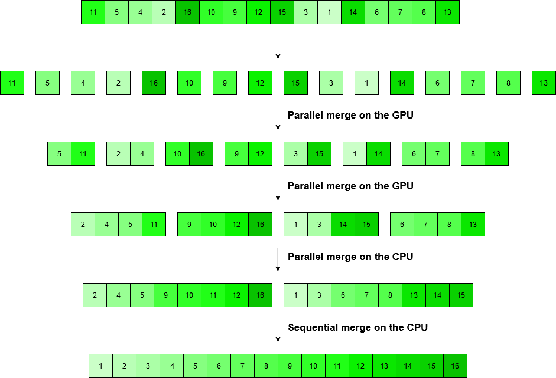
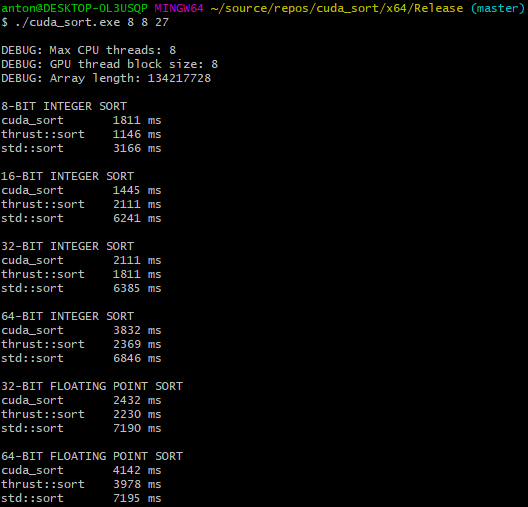

# cuda_sort

## Description

This project contains the source code of `cuda_sort` and a benchmark program that sorts arrays of integers and floating point numbers of various sizes with `cuda_sort`, `thrust::sort` (Nvidia's own GPU-accelerated sort implementation) and `std::sort` and prints the results.

The project is purely educational by nature; the code is not meant for general use.

## Working principle

`Cuda_sort` works exactly like an ordinary merge sort would, except that the merging is done in parallel rather than sequentially in a recursive manner, and both the GPU and CPU are involved. The distribution of work between the two processing units is visualized below.

In summary:

1. The input data is copied from RAM to VRAM.
2. The GPU performs parallel merging as long as it is more efficient than merging on the CPU.
3. The input data is copied from VRAM to RAM.
4. The CPU performs parallel merging on multiple threads.
5. The final merge is done sequentially on a single CPU thread.

## Performance

Below is a screenshot of the results of the benchmark.

Obviously, the highly optimized `thrust::sort` is faster than `cuda_sort`. However, to my satisfaction, the performance of `cuda_sort` is in the same ballpark.

Interestingly, it appears that both GPU sorts are slow in the 64-bit category, whereas the performance of `std::sort` seems rather constant.

## Usage

### Cuda_sort

The interface of `cuda_sort` is simple enough:

`template<typename T> T* cuda_sort(T* h_src, size_t array_length, size_t cpu_threads = 8, size_t gpu_thread_block_size = 8)`

| Symbol                  | Description                                                                               |
|:------------------------|:------------------------------------------------------------------------------------------|
| `T`                     | The element type contained by the array. Has to be a variation of `int` or `float`        |
| `h_src`                 | The array to be sorted                                                                    |
| `array_length`          | The number of elements in the array. Must be a power of 2                                 |
| `cpu_threads`           | The maximum number of CPU threads running concurrently. Must be a power of 2 (default: 8) |
| `gpu_thread_block_size` | The number of threads per GPU thread block. Must be a power of 2 (default: 8)             |
| `return value`          | `h_src`                                                                                   |

The user is responsible for checking that the conditions set above are met.

### Benchmark

The benchmark program has a very simple command line interface:

`cuda_sort.exe <number of CPU threads> <GPU thread block size> <array size as power of two>`

The constraints set for the parameters of `cuda_sort` apply. Passing `d` as a command line argument will make the benchmark use the default value.

## Compilation

On Windows:
1. Install Microsoft Visual Studio + Microsoft Visual C++ Compiler
2. Install CUDA Toolkit (with Visual Studio extension)
3. Open `cuda_sort.sln` in Visual Studio and compile the solution

## Compatibility

`Cuda_sort` has only been tested with an Nvidia GTX 1070 graphics card and an Intel i7-4790K processor.

## License

The If-you-are-crazy-enough-to-use-this-go-ahead License 1.0. The author will not be responsible for the frying of any piece of silicon or any other form of harm that might take place.
